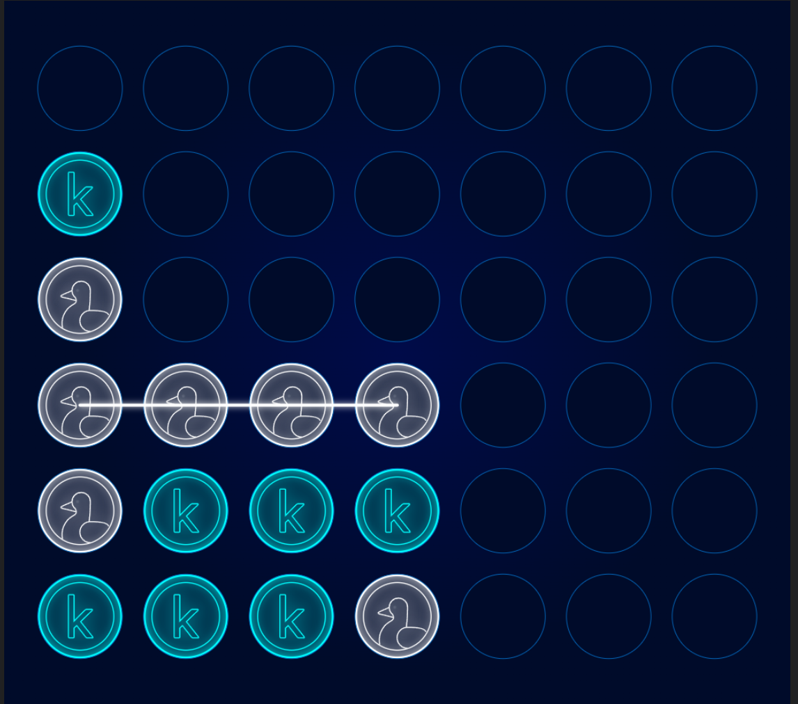

# connectFour

* Commit 1 - Initial Commit
* Commit 2 - Adding all Kaggle dependencies and first connect four bot model. (Note: Adding the * venv folder was too many objects and I reseted such by the next commit.) - current score: 154.4
* Commit 3 - Added .gitignore file to prevent venv tracking
* Commit 4 - Added Heuristic bot and images folder. - current score: 600.0
* Image of Heuristic bot playing: 
